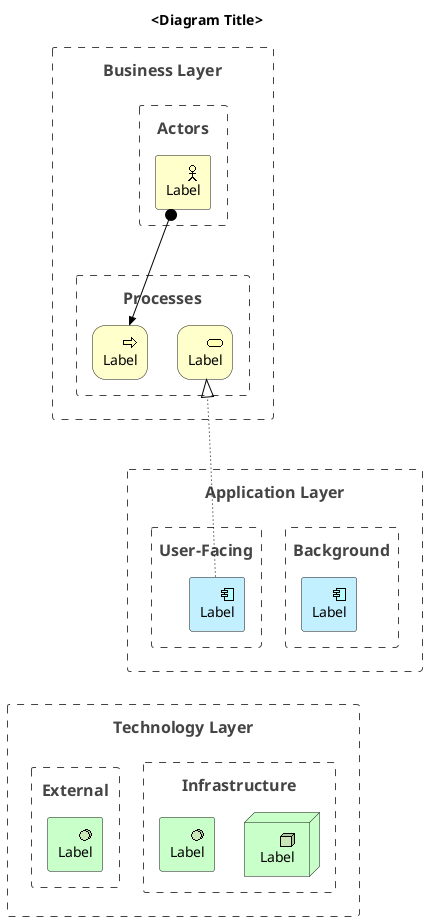

# PlantUML ArchiMate Skill

Generate, save, and render ArchiMate 3.x diagrams using PlantUML.

**Environment:** GDX Spark (aarch64 Ubuntu). PlantUML wrapper at `/usr/local/bin/plantuml`. ArchiMate stdlib built-in.

Read `/home/piotr/.claude/skills/plantuml-archimate/references/archimate-reference.md` for the complete macro list, relation matrix, and example diagrams.

---

## Workflow

### 1. Understand the request

Identify diagram type, layers in scope, elements, and language (Polish/English — match the user).

If the layers to show are ambiguous, ask one clarifying question before proceeding.

### 2. Generate element & relation list — wait for confirmation

Save `<diagram-name>-list-structure.md` next to the output. This is the inventory — every element and every relation explicitly listed. The user reviews this for completeness before anything visual is drawn.

Format:
```markdown
# [System Name] — Element & Relation List

## Elements

### Business Layer
| Group | Element | Type |
|-------|---------|------|
| Actors | Internal User | Business_Actor |
| Processes & Services | Invoice Assignment | Business_Process |

### Application Layer
| Group | Element | Type |
|-------|---------|------|
| Backend APIs | Main API | Application_Component |
| Background | Import Cron | Application_Component |

### Technology Layer
| Group | Element | Type |
|-------|---------|------|
| Infrastructure | Docker Compose Host | Technology_Node |
| External | Azure AD | Technology_SystemSoftware |

## Relations
| From | Relation | To | Label |
|------|----------|----|-------|
| Internal User | Assignment | Invoice Assignment | executes |
| Main API | Realization | Invoice Mgmt Service | |
| Docker Compose Host | Serving | Main API | hosts |
```

Show the list in the chat and ask:
> "List saved to `<name>-list-structure.md`. Does this look complete? Any elements or relations to add, remove, or correct?"

**Wait for confirmation before continuing.**

### 3. Generate ASCII preview

Save `<diagram-name>-view-structure.md` next to the output. Generate this from the approved list in step 2 — it must be an ASCII diagram, NOT tables or bullet lists.

Format: three horizontal bands (Business / Application / Technology), elements as boxes inside each band. Between bands, add a connector row with labeled arrows showing the key cross-layer relations.

Example:
```
╔══════════════════════════════════════════════════════════╗
║  BUSINESS LAYER                                          ║
║  [Internal User] ──assigns──> [Invoice Assignment]       ║
║                                [Invoice Mgmt Service]    ║
╠═══════════ ↓ realizes (App→Biz)  ↓ triggers ════════════╣
║  APPLICATION LAYER                                       ║
║  [Frontend SPA]   [Import Cron]   [Invoice Mgmt Comp]    ║
╠═══════════ ↓ hosts (Tech→App) ══════════════════════════╣
║  TECHNOLOGY LAYER                                        ║
║  [Docker Host]   [Azure AD]                              ║
╚══════════════════════════════════════════════════════════╝
```

Put only the 2–3 most important cross-layer relations in the connector rows. If there are no relations between two adjacent layers, use a plain `╠═══╣` separator.

Show the ASCII diagram in the chat, then **immediately proceed to step 4** — state: "View saved to `<name>-view-structure.md`. Generating PUML now…"

### 4. Generate the `.puml` file

**ALWAYS write a new `.puml` file from scratch. Never check whether the file already exists. Never skip this step. Overwrite any existing file silently.**

File naming: `<descriptive-kebab-case>.puml`
Output: same directory as the input file (or CWD for inline descriptions).

#### Layer ordering — critical rule

Target layout: **Business on top → Application in middle → Technology at bottom**.

Problem: `Rel_Serving(techNode, appComp, "hosts")` creates a Tech→App directed edge. Graphviz places edge sources ABOVE targets, so Tech ends up on top. Hidden arrows that point back at the same pair create a **direct cycle** — Graphviz breaks cycles unpredictably, so they do not reliably fix the order.

**Fix — two rules that must both be followed:**

**Rule 1 — Limit visible cross-layer relations.** Only show the 2–3 most architecturally significant cross-layer relations. Do NOT draw `Rel_Serving(tech, app, "hosts")` for every hosting pair — layer membership already implies hosting. Only draw relations that add information not obvious from the layer structure.

**Rule 2 — Hidden arrows must target elements with NO direct Rel_Serving back to them.** Pick one "anchor" element per lower layer that has few or no visible cross-layer serving arrows. Route ALL hidden ordering arrows through that anchor.

```plantuml
' Example: nodeId is the anchor tech element (few/no Rel_Serving TO app elements)
' EVERY business element → first app element:
actorId   -[hidden]down-> compId
procId    -[hidden]down-> compId
svcId     -[hidden]down-> compId
' EVERY application element → anchor tech element:
compId    -[hidden]down-> nodeId
batchId   -[hidden]down-> nodeId
extComp   -[hidden]down-> nodeId
dataObj   -[hidden]down-> nodeId
```

Choose the anchor element carefully: it should be an infrastructure/passive element (e.g. a database, a network, an external system) that does NOT have `Rel_Serving(anchor, X)` pointing to any of the app elements targeted by the hidden arrows. This avoids direct cycles.

#### Template



#### Layout rules

- **Always** `top to bottom direction` — explicit, never rely on default
- **Never** `!pragma layout smetana` — causes overlapping arrows
- **Never** `skinparam linetype ortho` — routes lines through box borders
- Each layer split into 2–3 sub-`Boundary` groups (horizontal columns within the layer)
- If a layer has >3 elements flat, split into sub-groups — prevents wide single-row layers
- Put all relations after all element declarations

### 5. Render and self-evaluate (max 2 attempts)

**Always render — never skip because a PNG already exists. Every run produces a fresh image.**

**Attempt 1:**
```bash
plantuml -tpng <path>/<filename>.puml -o <path>/
```

Check proportions:
```bash
python3 -c "
from PIL import Image
img = Image.open('<path>/<filename>.png')
w, h = img.size
print(f'{w}x{h} ratio={w/h:.2f}')
"
```

**Evaluate:**
- Ratio 1.0–2.2 → acceptable, done
- Ratio > 2.2 (too wide) → increase `ranksep` by +20, retry
- Ratio < 0.7 (too tall) → decrease `ranksep` by -15, retry
- Layers in wrong order (Technology on top etc.) → check that hidden arrows use real element IDs, fix and retry

**Attempt 2:** adjust, rewrite `.puml`, re-render. After 2 attempts pick the one closest to ratio 1.6. No third attempt.

PNG fails → try SVG: `plantuml -tsvg ...`

### 6. Show result and ask for feedback

```bash
xdg-open <path>/<filename>.png
```

Ask ONE question:
> "Diagram opened — `<filename>.png` (WxH, ratio X:1). Does it look OK? Any changes needed?"

- OK → step 7
- Specific feedback → one targeted fix, re-render, done. No second question.

### 7. Confirm outputs

Report:
1. File paths (`.puml` and `.png`)
2. Final dimensions and ratio
3. 2–4 bullet architectural decisions (why elements are in those layers, key relations)

Then ask ONE optional question:
> "Chcesz też podgląd ASCII w czacie? / Want the ASCII structure in the chat too?"

If yes — print the contents of the already-saved `<name>-view-structure.md` inline in the chat. No regeneration needed.

If no — done.

---

## Diagram Types

| Type | When to use | Key elements |
|------|-------------|--------------|
| **Layered View** | Full system across Business/Application/Technology | All three layers, cross-layer Serving/Realization |
| **Application Context** | Application components and interfaces | Application layer + interfaces + data objects |
| **Deployment** | Where software runs | Technology: Nodes, SystemSoftware, Artifacts |
| **Motivation** | Goals, drivers, requirements, stakeholders | Stakeholder, Driver, Goal, Requirement |
| **Migration** | Transition between plateaux | Plateau, Gap, Work Package |

---

## Common mistakes

- `Technology_Network` does not exist → use `Technology_CommunicationNetwork`
- Composition/Aggregation across layers → invalid, keep within same layer
- `!include <C4/C4_Context>` → NOT ArchiMate, never mix
- Unconnected elements → every element needs at least one relation
- Generic IDs (`a1`, `a2`) → use descriptive IDs
- >15 elements → offer to split into sub-diagrams
- Hidden arrows between Boundary wrappers → does NOT enforce order; use real element IDs
