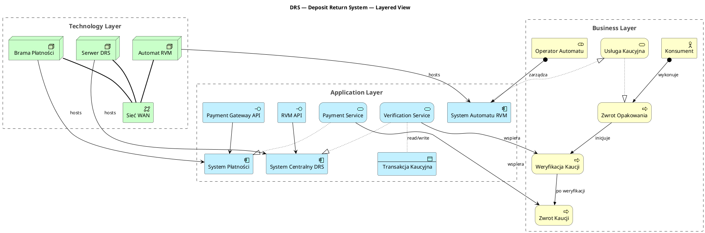
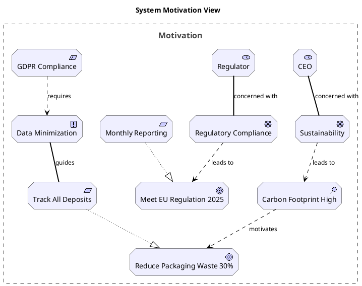
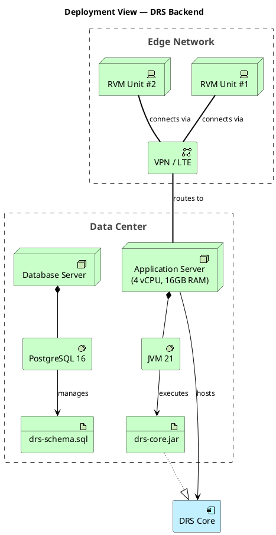

# ArchiMate PlantUML Reference

Complete macro reference for PlantUML ArchiMate stdlib (`!include <archimate/Archimate>`).

---

## Table of Contents
1. [Element Macros by Layer](#element-macros-by-layer)
2. [Relation Macros](#relation-macros)
3. [Relation Validity Matrix](#relation-validity-matrix)
4. [Diagram Examples](#diagram-examples)

---

## Element Macros by Layer

All macros follow the pattern: `Layer_Type(id, "Label")` or `Layer_Type(id, "Label", "optional-description")`

### Strategy Layer
| Macro | ArchiMate Element |
|-------|-------------------|
| `Strategy_Resource(id, "label")` | Resource |
| `Strategy_Capability(id, "label")` | Capability |
| `Strategy_CourseOfAction(id, "label")` | Course of Action |
| `Strategy_ValueStream(id, "label")` | Value Stream |

### Business Layer
| Macro | ArchiMate Element |
|-------|-------------------|
| `Business_Actor(id, "label")` | Business Actor |
| `Business_Role(id, "label")` | Business Role |
| `Business_Collaboration(id, "label")` | Business Collaboration |
| `Business_Interface(id, "label")` | Business Interface |
| `Business_Process(id, "label")` | Business Process |
| `Business_Function(id, "label")` | Business Function |
| `Business_Interaction(id, "label")` | Business Interaction |
| `Business_Event(id, "label")` | Business Event |
| `Business_Service(id, "label")` | Business Service |
| `Business_Object(id, "label")` | Business Object |
| `Business_Contract(id, "label")` | Business Contract |
| `Business_Representation(id, "label")` | Business Representation |
| `Business_Product(id, "label")` | Business Product |

### Application Layer
| Macro | ArchiMate Element |
|-------|-------------------|
| `Application_Component(id, "label")` | Application Component |
| `Application_Collaboration(id, "label")` | Application Collaboration |
| `Application_Interface(id, "label")` | Application Interface |
| `Application_Function(id, "label")` | Application Function |
| `Application_Interaction(id, "label")` | Application Interaction |
| `Application_Event(id, "label")` | Application Event |
| `Application_Service(id, "label")` | Application Service |
| `Application_DataObject(id, "label")` | Data Object |

### Technology Layer
| Macro | ArchiMate Element |
|-------|-------------------|
| `Technology_Node(id, "label")` | Node |
| `Technology_Device(id, "label")` | Device |
| `Technology_SystemSoftware(id, "label")` | System Software |
| `Technology_Collaboration(id, "label")` | Technology Collaboration |
| `Technology_Interface(id, "label")` | Technology Interface |
| `Technology_Path(id, "label")` | Path |
| `Technology_CommunicationNetwork(id, "label")` | Communication Network |
| `Technology_Function(id, "label")` | Technology Function |
| `Technology_Process(id, "label")` | Technology Process |
| `Technology_Interaction(id, "label")` | Technology Interaction |
| `Technology_Event(id, "label")` | Technology Event |
| `Technology_Service(id, "label")` | Technology Service |
| `Technology_Artifact(id, "label")` | Artifact |

### Physical Layer
| Macro | ArchiMate Element |
|-------|-------------------|
| `Physical_Equipment(id, "label")` | Equipment |
| `Physical_Facility(id, "label")` | Facility |
| `Physical_DistributionNetwork(id, "label")` | Distribution Network |
| `Physical_Material(id, "label")` | Material |

### Motivation Layer
| Macro | ArchiMate Element |
|-------|-------------------|
| `Motivation_Stakeholder(id, "label")` | Stakeholder |
| `Motivation_Driver(id, "label")` | Driver |
| `Motivation_Assessment(id, "label")` | Assessment |
| `Motivation_Goal(id, "label")` | Goal |
| `Motivation_Outcome(id, "label")` | Outcome |
| `Motivation_Principle(id, "label")` | Principle |
| `Motivation_Requirement(id, "label")` | Requirement |
| `Motivation_Constraint(id, "label")` | Constraint |
| `Motivation_Meaning(id, "label")` | Meaning |
| `Motivation_Value(id, "label")` | Value |

### Implementation & Migration Layer
| Macro | ArchiMate Element |
|-------|-------------------|
| `ImplementationMigration_WorkPackage(id, "label")` | Work Package |
| `ImplementationMigration_Deliverable(id, "label")` | Deliverable |
| `ImplementationMigration_ImplementationEvent(id, "label")` | Implementation Event |
| `ImplementationMigration_Plateau(id, "label")` | Plateau |
| `ImplementationMigration_Gap(id, "label")` | Gap |

### Composite Elements
| Macro | ArchiMate Element |
|-------|-------------------|
| `Grouping(id, "label")` | Grouping |
| `Location(id, "label")` | Location |
| `Boundary(id, "label") { ... }` | Boundary (grouping container) |

---

## Relation Macros

All relations: `Rel_Type(fromId, toId, "label")`
Label can be empty string `""` when the relation type is self-explanatory.

### Structural Relations
| Macro | Arrow style | Meaning |
|-------|-------------|---------|
| `Rel_Composition(parent, child, "")` | filled diamond | Child is part of parent, lifecycle bound |
| `Rel_Aggregation(whole, part, "")` | open diamond | Part belongs to whole, independent lifecycle |
| `Rel_Assignment(active, behavior, "")` | filled circle + line | Active element performs behavior |
| `Rel_Realization(realizing, realized, "")` | dashed + open triangle | Lower layer element realizes upper layer element |

### Dependency Relations
| Macro | Arrow style | Meaning |
|-------|-------------|---------|
| `Rel_Serving(provider, consumer, "")` | open arrowhead | Provider serves consumer (use this instead of "uses") |
| `Rel_Access(behavior, passive, "")` | dashed open arrow | Behavior accesses data object (read/write/execute) |
| `Rel_Influence(from, to, "label")` | dashed open arrow | Indirect influence (use in motivation diagrams) |

### Dynamic Relations
| Macro | Arrow style | Meaning |
|-------|-------------|---------|
| `Rel_Triggering(trigger, triggered, "")` | filled arrowhead | One element triggers another (causal sequence) |
| `Rel_Flow(from, to, "label")` | open arrow | Information/material flows from one to another |

### Other Relations
| Macro | Arrow style | Meaning |
|-------|-------------|---------|
| `Rel_Specialization(special, general, "")` | inheritance arrow | Specialization of a concept |
| `Rel_Association(from, to, "label")` | plain line | Generic untyped association (use as last resort) |

---

## Relation Validity Matrix

The most important cross-layer relationships:

| From \ To | Business Service | App Service | Tech Service | App Component | Tech Node |
|-----------|-----------------|-------------|--------------|---------------|-----------|
| Business Process | Triggering, Flow | — | — | — | — |
| App Component | Realization (→ Bus. Service) | Realization | — | Composition, Serving | — |
| App Service | — | — | — | — | — |
| Tech Node | — | Serving | Serving | Serving | Composition |
| Tech Artifact | Realization (→ App Comp.) | — | — | — | — |

**Key cross-layer rules:**
- `Business_Process` → `Application_Service`: use `Rel_Serving` (app serves business)
- `Application_Component` → `Business_Service`: use `Rel_Realization` (app realizes business service)
- `Technology_Node` → `Application_Component`: use `Rel_Serving` (node hosts/serves component)
- `Technology_Artifact` → `Application_Component`: use `Rel_Realization` (artifact realizes component)
- `Business_Actor` → `Business_Role`: use `Rel_Assignment`
- `Business_Role` → `Business_Process`: use `Rel_Assignment`
- Composition/Aggregation: **same layer only**

---

## Diagram Examples

### Example 1: Layered View (3-layer system)



---

### Example 2: Motivation Diagram



---

### Example 3: Deployment / Infrastructure View



---

### Example 4: Migration / Plateau View

```plantuml
@startuml migration-view
!include <archimate/Archimate>

title Migration View — DRS Rollout

Boundary(current, "Plateau 0: Current State") {
    ImplementationMigration_Plateau(p0, "Manual Deposit Process")
    Business_Process(manualReturn, "Manual Return")
}

Boundary(phase1, "Plateau 1: Pilot (Q2 2025)") {
    ImplementationMigration_Plateau(p1, "RVM Pilot — 10 machines")
    ImplementationMigration_WorkPackage(wp1, "Install RVM Units")
    ImplementationMigration_WorkPackage(wp2, "Deploy DRS Core v1")
    ImplementationMigration_Deliverable(rvmInstalled, "RVM Units Operational")
}

Boundary(phase2, "Plateau 2: National (Q4 2025)") {
    ImplementationMigration_Plateau(p2, "Full National DRS")
    ImplementationMigration_WorkPackage(wp3, "Scale to 500 RVMs")
    ImplementationMigration_Gap(gap1, "Payment Integration Gap")
}

Rel_Triggering(p0, p1, "transition")
Rel_Triggering(p1, p2, "transition")
Rel_Composition(p1, wp1, "")
Rel_Composition(p1, wp2, "")
Rel_Realization(wp1, rvmInstalled, "")
Rel_Association(gap1, p2, "blocks")

@enduml
```

---

## Quick Troubleshooting

| Error | Likely cause | Fix |
|-------|-------------|-----|
| `Unknown macro` | Typo in macro name | Check this reference exactly |
| Diagram renders but looks wrong | Wrong relation direction | ArchiMate relations are directional — check the matrix |
| Elements float unconnected | Missing relation | Every element needs ≥1 relation |
| Massive unreadable diagram | Too many elements | Split into focused sub-diagrams |
| Layout overlaps | Default layout struggling | Add `!pragma layout smetana` after the include |
